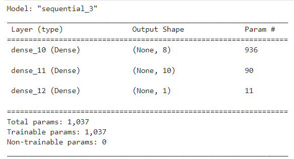
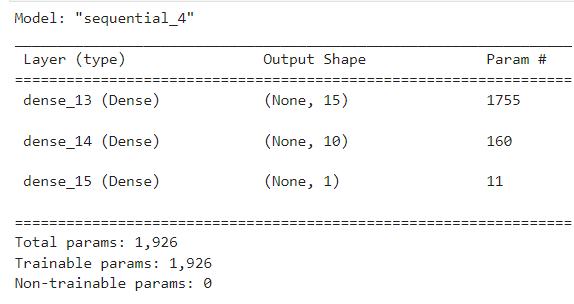
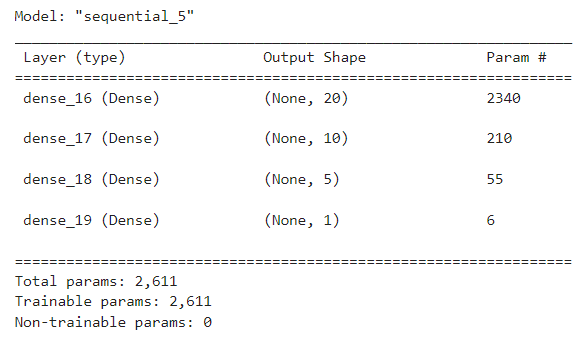

# Venture Funding with Deep Learning

This project analyzes a CSV file containing more than 34,000 organizations that have received funding from a VC over the years and, through machine learning and neural networks, a binary classifier model is created in order tol predict whether an applicant will become a successful business.

For this, we follow these steps:

* Preparing the data for use on a neural network model.
* Compiling and evaluating a binary classification model using a neural network.
* Optimizing the neural network model.

The report then provides some qualitative insights based on the data, analysing if there were arbitrage opportunities, when and what size.

---

## Technologies

The whole project is implemented in Python, writen in Jupyter lab using the Pandas library: 

* ```import pandas as pd```
* ```from pathlib import Path```

We use scikit-learn’s `StandardScaler()` to preprocess the dataset so that it can be used to compile and evaluate the neural network model afterwards.

* ```from sklearn.model_selection import train_test_split```
* ```from sklearn.preprocessing import StandardScaler,OneHotEncoder```

Then we use ```TensorFlow``` to design, compile and fit binary classification deep neural network models that use the dataset’s features to predict whether this VC's funded startups will be successful or not:

* ```import tensorflow as tf```
* ```from tensorflow.keras.layers import Dense```
* ```from tensorflow.keras.models import Sequential```
* ```from tensorflow.keras.models import load_model```

Finally, we save the models in .h5 files:

* ```import h5py```

---

## Conclusions

The model is optimized to improve its accuracy by trying different adjustments, such as:

* Adjusting the input data by dropping different features columns to ensure that no variables or outliers confuse the model.
* Adding more neurons (nodes) to a hidden layer.
* Adding more hidden layers.
* Using different activation functions for the hidden layers.
* Adding to or reduce the number of epochs in the training regimen.


Here is the comparison between the three models created:

**Original Model**




**Alternative Model 1**




**Alternative Model 2**




After compiling the three models, we see that the original model has a loss of 0.6509 and an accuracy of 0.7223, Alternative Model 1 has a lower loss of 0.6322 and a slightly higher accuracy of 0.7248, and Alternative Model 2 has the lowest loss of 0.5702 and a slightly higher accuracy of 0.7262.

Overall, the **second alternative model** appears to be the best performing model among the three based on the metrics analyzed. In this case, the improvement came from adding more hidden layers and modifying the activation function in some of them.

---

## Contributors

Feature developed by Lourdes Dominguez [(LinkedIn profile)](https://www.linkedin.com/in/lourdes-dominguez-bengoa-12333044/)

---

## License

Use only for academic purposes.